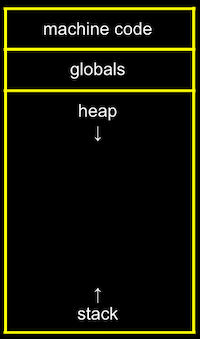

## 5강. 메모리

[메모리 주소](#메모리-주소)  
[포인터](#포인터)  
[문자열과 포인터](#문자열과-포인터)  
[문자열 복사](#문자열-복사)  
[메모리 할당과 해제](#메모리-할당과-해제)  
[메모리 교환, 스택, 힙](#메모리-교환-스택-힙)  
[Reference](#reference)

##### 작성된 예제 코드는 [CS50 Sandbox](https://ide.cs50.io/)를 사용합니다.

<br><br>

### 메모리 주소

#### 16진수

- 컴퓨터는 숫자를 16진수로 표현하는 경우가 많다.
- 16진수는 2진수를 훨씬 간단하게 표현할 수 있다.
- 2개의 16진수가 1바이트의 2진수로 변환되기 때문이다.

```c
ASCII코드에 의하면  "A, B, C"는

> 10진수로 65, 66, 67
> 2진수로 01000001, 01000010, 01000011
> 16진수로 0x41, 0x42, 0x43
```

<br>

#### 메모리 주소 : `& 연산자`

```c
#include <stdio.h>

int main(void)
{
    int n = 50;
    printf("%p\n", &n);
    // &n은 n의 메모리 주소를 가리킴(포인터). %p 는 포인터를 지칭

    int x = 50;
    printf("%i\n", *&x);
    // *는 그 주소에 해당하는 값을 가리킴.
}

// 출력 결과
// 0x7ffea532931c
// 50
```

<br>

### 포인터

- `* 연산자`
- - 연산자를 이용해 포인터 역할을 하는 변수를 선언할 수 있다.

```c
// 선형검색, 구조체 예시

// typedef struct

// strcmp : 문자열 비교 함수
// str1 < str2 인 경우에는 음수 반환
// str1 > str2 인 경우에는 양수 반환
// str1 == str2 인 경우에는 0을 반환 합니다.

#include <stdio.h>

int main(void)
{
   int n = 50;
   int *p = &n;
   printf("%p\n", p);
   printf("%i\n", *p);
}

// 0x7ffea532931c
// 50
```

<br>

### 문자열과 포인터

`string s = “EMMA”;`

- 문자열은 결국 `문자의 배열`이고, s[0], s[1], s[2], ... 와 같이 하나의 문자가 배열의 한 부분을 나타낸다.
- 가장 마지막 `\0`는 0으로 이루어진 바이트로, 문자열의 끝을 표시하는 약속. `널종단문자`
- 변수 s는 결국 `문자열을 가리키는 포인터`이다.

```c
// cs50의 라이브러리의 string의 정의
typedef char *string

// 결국 char *와 string은 같다.
#include <stdio.h>

int main(void)
{
    char *s = "EMMA";
    printf("%s\n", s);
}
```

- `char *s`에서 s라는 변수는 문자에 대한 포인터가 되고, “EMMA”라는 문자열의 가장 첫 번째 값을 저장한다.

<br>

```c
#include <stdio.h>

int main(void)
{
  char *s = "EMMA";
  printf("%p\n", s);
  printf("%p\n", &s[0]);
  printf("%p\n", &s[1]);
  printf("%p\n", &s[2]);
  printf("%p\n", &s[3]);
}

```

- 문자열의 n번째에 해당하는 주소값 출력
- `s`와 `&s[0]` 는 같은 주소를 가리킴

<br>

### 문자열 복사

- 문자열을 복사하는 방법

1. 정해진 크기만큼의 메모리를 할당
2. 메모리에 복사할 문자를 하나씩 할당

- `malloc` : 정해진 크기 만큼 메모리를 할당한다.

```c
#include <cs50.h>
#include <ctype.h>
#include <stdio.h>
#include <string.h>
#include <stdlib.h>

int main(void)
{
    char *s = get_string("s: ");
    char *t = malloc(strlen(s) + 1); // 문자열 길이 + 널종단문자 길이

    for (int i = 0, n = strlen(s); i < n + 1; i++)
    {
        t[i] = s[i];
    }

    t[0] = toupper(t[0]); // 대문자로 변경

    printf("s: %s\n", s);
    printf("t: %s\n", t);
}
```

<br>

### 메모리 할당과 해제

- 메모리 할당 이후 다 쓴 메모리를 해제해줘야 한다.
- 그렇지 않은 경우 메모리에 저장된 값은 쓰레기 값으로 남게 되어 메모리 용량의 낭비가 발생하게 된다.
- 이것을 `메모리 누수`라고 부른다.
- `free` 함수를 사용해 메모리를 해제할 수 있다.

```c
#include <stdlib.h>

void f(void)
{
    // int(4바이트) * 10 => 40바이트를 할당
    int *x = malloc(10 * sizeof(int));
    x[10] = 0;
}

int main(void)
{
    f();
    return 0;
}
```

- 위 코드는 2가지 에러가 있다. `버퍼 오버플로우`, `메모리 누수`
- 10개의 int형 배열을 만들었는데 `x[10] = 0`은 11번째 인덱스에 접근하는 것이라, 정의되지 않은 것이기 때문에 `버퍼 오버플로우`가 발생한다.
- `x`라는 포인터를 통해 할당한 메모리가 `메모리 누수`를 발생시킨다. `free(x)`로 메모리를 해제시켜준다.

<br>

### 메모리 교환, 스택, 힙

- 메모리 내부의 데이터 저장 구역
- 
- `machine code` : 컴파일된 바이너리가 저장
- `globals` : 프로그램 안에서 저장된 전역 변수가 저장
- `heap` : malloc으로 할당된 메모리의 데이터가 저장
- `stack` : 프로그램 내의 함수와 관련된 것들이 저장
- heap과 stack의 메모리 사용 범위가 늘어나면, 기존의 값을 침범하는 상황이 발생한다.
  - `힙 오버플로우`
  - `스택 오버플로우`

<br>

```c
#include <stdio.h>

void swap(int *a, int *b);

int main(void)
{
    int x = 1;
    int y = 2;

    printf("x is %i, y is %i\n", x, y);
    swap(&x, &y);
    printf("x is %i, y is %i\n", x, y);
}

void swap(int *a, int *b)
{
    int tmp = *a;
    *a = *b;
    *b = tmp;
}
```

- 포인터로 주소를 이용해 값을 저장하고 교환 한다.

<br><br>

---

### **Reference**

[모두를 위한 컴퓨터 과학 (CS50 2019), David J. Malan](https://www.boostcourse.org/cs112)
