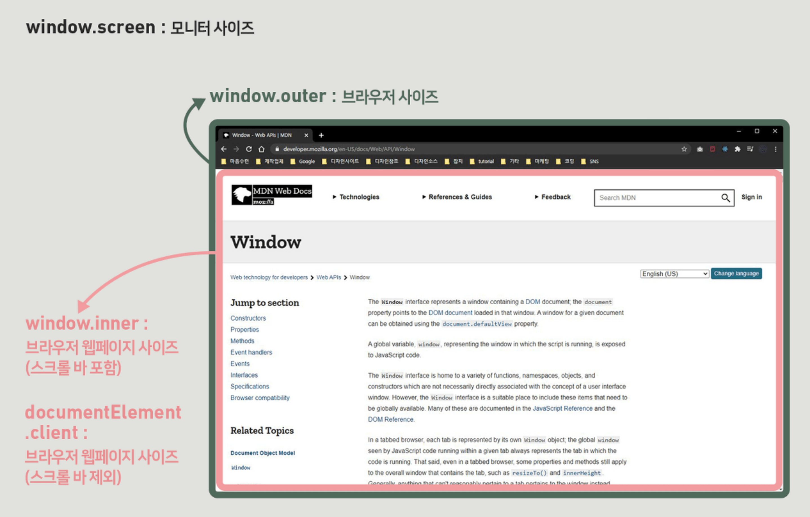

# 윈도우 사이즈와 브라우저 좌표

[Window Size](#window-size)  
[Brower 좌표](#brower-좌표)

## Window Size



<br>

```js
`window.screen`;
window.screen.width;
window.screen.height;

`window.outer`;
window.outerWidth;
window.outerHeight;

`window.inner`;
window.innerWidth;
window.innerHeight;

`documentElement`;
documentElement.clientWidth;
documentElement.clientHeight;
```

<br>

## Brower 좌표

### `Element.getBoundingClientRect()`

- Element 크기(`width, height`)와 뷰포트(`viewport`)를 기준으로 한  
  위치(`left, top, right, bottom, x, y`) 값을 속성으로 갖는 DOMRect 객체를 리턴

<br>


```js
DOMRect
{
  x: 50,
  y: 50,
  width: 300,
  height: 300,
  top: 50,
  bottom: 350,
  left: 50
  right: 350
}
```

<br>

### `client`

- 클라이언트 영역 내에서 좌표를 제공
- 브라우저 표시 화면의 크기
- 기준 -> (0,0)
- `element.clientX` `element.clientY`

### `page`

- 스크롤 영역을 포함한 전체 문서 영역 내에서 좌표를 제공
- 기준 -> (0,0)
- - `element.pageX` `element.pageY`

### `offset`

- 이벤트 대상이 기준
- 이벤트 대상 객체에서의 상대적 좌표를 반환  
  예시) 박스 내부에서 클릭한 위치를 찾을 때, 해당 박스의 (0,0)이 기준
  - `element.offsetX` `element.offsetY`

<br><br>

---

### **Reference**

- https://designer-ej.tistory.com/
- [프론트엔드 필수 브라우저 101, 드림코딩 by 엘리](https://academy.dream-coding.com/courses/browser101)
