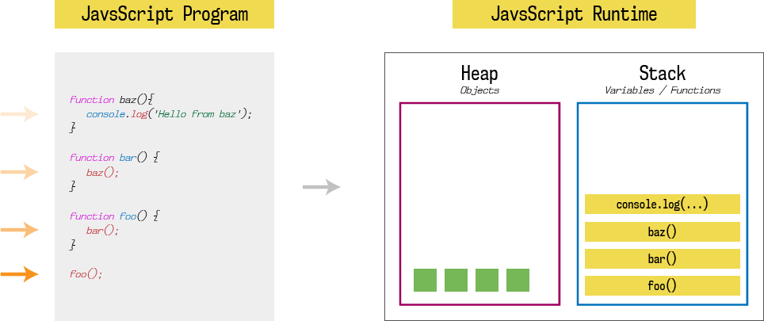
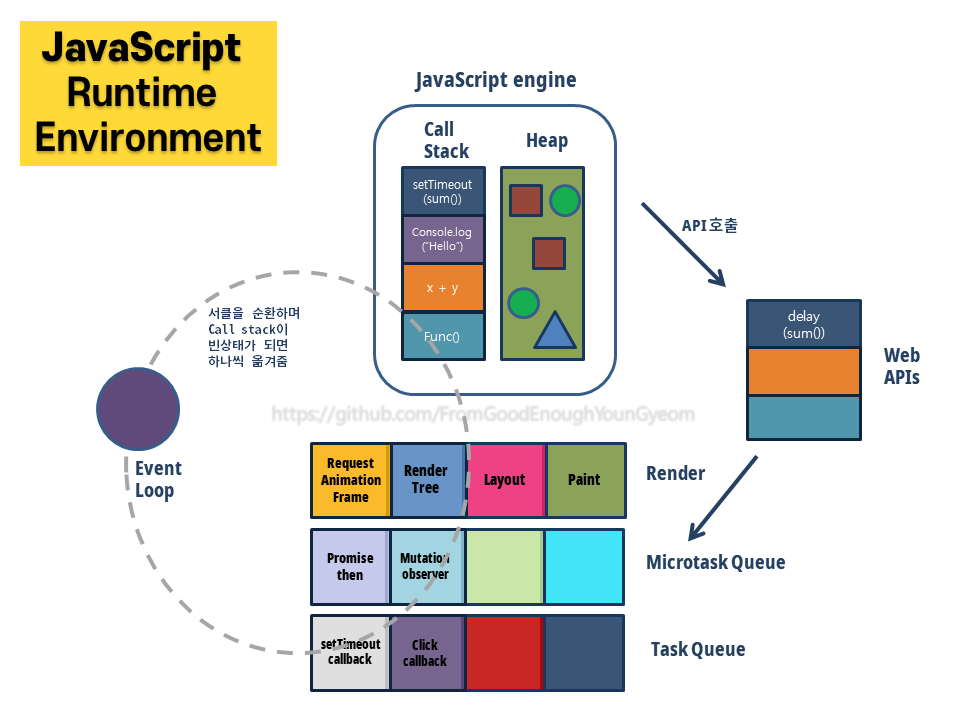
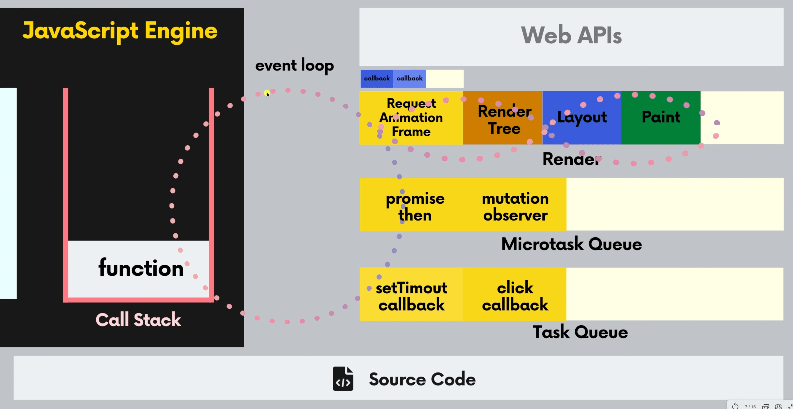

# 자바스크립트 런타임 환경

## 자바스크립트 엔진

#### 자바스크립트는 `Single Threaded Language`



- 힙과 스택으로 구성
  - `Memory Heap`: 할당된 변수, 선언된 함수 등이 저장 된다.
  - `Call Stack`: 실행되는 함수들이 동작하는 공간

<br>

## 자바스크립트 런타임 환경

- 브라우저 프로그램은 여러 개의 쓰레드가 있어서 WebAPI 사용시 멀티쓰레딩 가능
- 자바스크립트 런타임 환경에서는 다양한 기능으로 멀티쓰레딩 같은 효과, `이벤트 루프` 이용

<br>



<br>



<br>

### `Task Queue`

- Web Apis에서 등록한 콜백 함수가 특정한 이벤트가 발생했을 때 태스크 큐에 들어온다.

<br>

### `Microtask Queue`

- `Promise`에 등록된 콜백(프로미스가 완료된 후 작동하는 then에 적힌, resolve된 후 들어오는 거), Web Api 중 `mutation observer` 등록된 콜백이 들어온다.

<br>

### `Render`

- 주기적으로 브라우저에서 요소 이동, 애니메이션 등 의 업데이트를 해준다.
- RAF -> 렌더트리 만들기 -> 레이아웃 계산 -> Paint -> Composite

<br>

- `Request Animation Frame`: 다음에 브라우저가 업데이트 되기 전에 실행되야할 콜백함수들이 들어온다.

<br>

### `Event Loop`

- `Call Stack`에서 수행 중인 함수가 있다면 콜스택이 비워질 때까지 콜스택에 멈춘다.
- `Render`는 약 60fps(16.7ms)주기로 업데이트하는데, 이벤트 루프가 도는 속도가 훨씬 빠르기 때문에 적당한 주기로 Render를 실행한다.(돌 때마다 실행 x)
- `Microtask Queue` 에 무언가 있으면 멈춤. 큐가 완전히 비워질 때까지 이곳에 멈춰 있는다. 중간에 새로 생긴 것들도 전부 실행.(콜 스택으로 보내기)
- `Task Queue`에 무언가 있으면 멈춤. 한 번 실행할 때 딱 하나의 아이템만 콜 스택으로 보내고 다시 루프를 돈다.

<br>

## 자바스크립트 런타임 환경 예제

### 1. 콜스택 -> 렌더

```js
const btn = document.querySelector('button');
btn.addEventListener('click', () => {
  const El = document.createElement('p');
  document.body.appendChild(El);
  element.style.color = 'yellow';
  element.style.margin = '20px';
});
```

- 웹API -> 태스크 큐 -> 콜 스택 -> 렌더
- append 보다 style을 뒤에 작성해도 상관 없다.(순서상관 x)
- 콜스택에서 콜백 함수의 모든 수행이 끝날 때까지(해당 아이템이 콜 스택에서 나갈 때까지) 기다린 후 렌더링 순서로 이동하게 된다.

<br>

### 2. 콜스택 -> 렌더

```js
const btn = document.querySelector('button');
const div = document.querySelector('div');

btn.addEventListener('click', () => {
  div.style.transform = 'translateX(300px)';
  div.style.transform = 'translateX(100px)';
});
```

- 웹API -> 태스크 큐 -> 콜 스택 -> 렌더
- 콜스택에서 모든 실행을 마치고 렌더로 넘어가기 때문에 `translateX(100px)`가 최종 반영되어 렌더로 넘어간다.

<br>

### 3. 무한 콜스택

```html
<html>
  <style>
    button:hover {
      background-color: aqua;
    }
  </style>
  <body>
    <button>while(true)</button>
    <script>
      const btn = document.querySelector('button');
      btn.addEventListener('click', () => {
        while (true) {}
      });
    </script>
  </body>
</html>
```

- 웹API -> 태스크 큐 -> 콜 스택(무한 반복)
- 콜스택에서 무한 반복 -> 렌더로 넘어가지 않아서 화면에 아무것도 표현되지 않는다.

<br>

### 4. setTimeout, Task Queue

```html
<html>
  <style>
    button:hover {
      background-color: aqua;
    }
  </style>
  <body>
    <button>Continue with setTimeout</button>
    <script>
      function doClick() {
        console.log('doClick');
        setTimeout(() => {
          console.log('setTimeout');
          doClick();
        }, 0);
      }
      const btn = document.querySelector('button');
      btn.addEventListener('click', () => doClick());
    </script>
  </body>
</html>
```

- 웹API -> 태스크 큐 -> 콜 스택 -> 렌더 -> ...반복
- Task Queue에서 한 번에 하나만 콜 스택으로 보내니까 계속 순회를 한다.
- 렌더에서 렌더링처리가 가능하다. 따라서 화면에 css호버가 제대로 동작한다.

<br>

### 5. Promise, MicroTask Queue

```html
<html>
  <style>
    button:hover {
      background-color: aqua;
    }
  </style>
  <body>
    <button>Continue with promise</button>
    <script>
      function doClick() {
        console.log('doClick');
        Promise.resolve(0).then(() => {
          console.log('then');
          doClick();
        });
      }
      const btn = document.querySelector('button');
      btn.addEventListener('click', () => doClick());
    </script>
  </body>
</html>
```

- 웹API -> 태스크 큐 -> 콜스택 ->  
  [ 마이크로 태스크 큐(then) -> 콜 스택 -> 마이크로 태스크 큐 -> 콜 스택 ...(무한 반복) ]
- 이벤트 루프가 마이크로 태스크 큐에서 계속 대기
- 이벤트 루프가 렌더 수행을 하지 않음

<br>

### 5. RequestAnimationFrame

```js
const btn = document.querySelector('btn');
btn.addEventListener('click', () => {
  requestAnimationFrame(() => (btn.style.backgroundColor = 'black'));
  requestAnimationFrame(() => (btn.style.backgroundColor = 'blue'));
  requestAnimationFrame(() => (btn.style.backgroundColor = 'green'));
});
```

- `requestAnimationFrame()`
- 웹API -> 태스크 큐 -> 콜스택 -> RAF Queue
- RAF 큐에 3가지 콜백함수가 들어가게 됨
- 클릭 리스너의 콜백이 콜스택에서 다 끝난 후 렌더 시작
- RAF 큐를 비운 후 -> 렌더트리 -> 레이아웃 -> 페인트 로 진행되기 때문에
- 제일 마지막의 `green` 색상이 적용된다.

<br><br>

---

### **Reference**

- [프론트엔드 필수 브라우저 101, 드림코딩 by 엘리](https://academy.dream-coding.com/courses/browser101)
